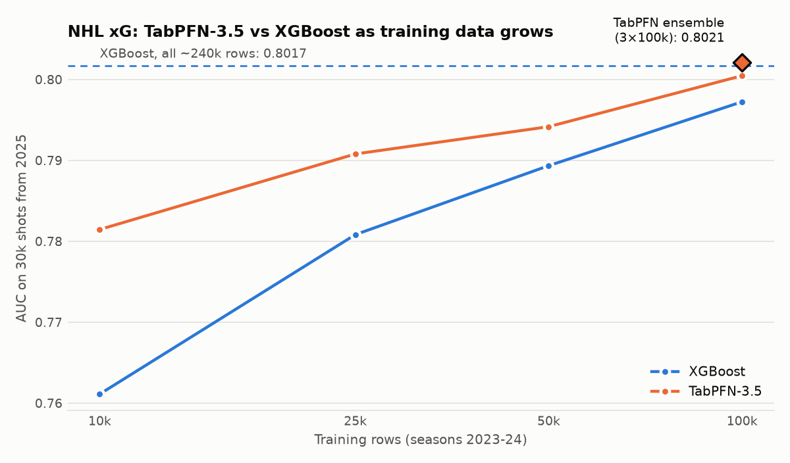

# xGoalBoost

Expected-goals (xG) model for NHL shots: gradient boosting (XGBoost, CatBoost) and TabPFN-3.5, trained on
[MoneyPuck](https://moneypuck.com/data.htm) shot data for seasons 2023–2025 (+ the start of 2026).

This is the full working repo. A trimmed, runnable submission for the TabPFN-3.5 hackathon lives in
`xGoalBoost-tabpfn`.

## Results

Target: `goal` for every shot attempt (SHOT, MISS, GOAL; ~365k rows, 7.1 % goals). Blocked shots are not in the data.
No MoneyPuck model outputs, player IDs or team IDs are used as features.

| Model | Validation | AUC |
|---|---|---|
| MoneyPuck `xGoal` (reference) | all rows | 0.782 |
| XGBoost | leave-one-season-out, 2023–25 | **0.806** ± 0.004 |
| CatBoost | leave-one-season-out, 2023–25 | 0.805 ± 0.003 |
| XGBoost | holdout 2026 (n=3 537) | 0.788 |
| XGBoost, 50k train rows | train 2023–24, test 2025 sample | 0.789 |
| TabPFN-3.5, 50k train rows | same | 0.794 |
| XGBoost, 100k train rows | same | 0.797 |
| TabPFN-3.5, 100k train rows | same | **0.8005** |
| TabPFN-3.5 ensemble, 3 × 100k | same | **0.8021** |

TabPFN beats XGBoost on the same 50k and 100k-row samples and nearly closes the gap to XGBoost on all ~240k rows
(0.802 on the same test sample), but it cannot use the whole training set in one fit. Averaging three 100k-row TabPFN fits reaches 0.8021, on par with
full-data XGBoost (the 0.0004 gap is within test-sample noise). See `learning_curve.png`, `results.json` and
`scaling_experiment.py`.



## A data leak worth knowing about

`homePenalty1TimeLeft`, `awayPenalty1TimeLeft` and the `*Penalty1Length` columns are recorded **after** the shot:
a power-play goal ends the minor penalty, so the time left is 0 on goal rows. With a 5v4 power play and the defender's
penalty time at 0, the goal rate is **68 %** against ~5 % otherwise (`analysis/penalty_leakage.py`).
Leaving these columns in gives a fake AUC of ~0.84; removing them gives ~0.80. Other columns deliberately excluded:
`xGoal`, `x*` outputs, `shotWasOnGoal`, `shotPlayStopped`, `shotGoalieFroze`, `shotGeneratedRebound`,
`shotPlayContinued*`, `timeUntilNextEvent`, `homeTeamWon`, `event`, score columns.

## Run

```bash
uv venv --python 3.13 .venv && uv pip install --python .venv/bin/python -r requirements.txt
# download shots_2023.csv ... shots_2026.csv from https://moneypuck.com/data.htm into the repo root
.venv/bin/python train.py
TABPFN_TOKEN=... .venv/bin/python tabpfn_test.py 50000 30000   # token from https://ux.priorlabs.ai/account
```

Data files are not committed (third-party data, ~200 MB). XGBoost and `tabpfn-client` can segfault when TabPFN is imported
before XGBoost in the same process, so `tabpfn_test.py` runs XGBoost first.

## Demo: xG shot map

`demo/index.html` is a self-contained interactive page (open it in a browser). Pick a shot type, situation (5v5, power play, short-handed, 3v3, empty net), rebound and rush, then click the rink to see the goal probability of a shot from that spot. The heat map is precomputed from an XGBoost model trained on seasons 2023-25. Rebuild with `python demo/build_demo.py` (needs the CSVs).
